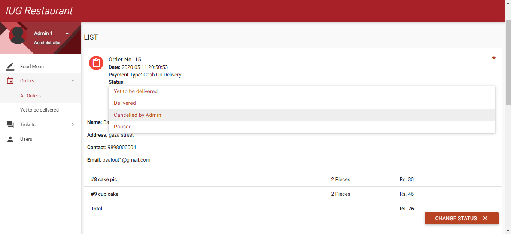

# IUG Restaurant ordering system
 ** ** There is a lot of scope online food ordering business and we can tap it to the max extent possible as everyone has access to an online ordering facility via the internet. Food business usually will have high demand and hence online business prospect for food ordering should be profitable. We will provide an easily accessible interface wherein the customer can view and place the order easily. 
 
 ** ** The customer can register initially with minimum details and will be allowed to check the menu items before ordering them, adding them to cart and submit the order. The system records the details in MySQL database so that it will be easy to retrieve later. The users of the system also include employee who will handle info related to product addition and delivery or rejection of the request.

## This project was programmed by:
         Baraa  Salout 			120160721
         Mohanned Abu Hassira	120161005
         Baraa Al-Astal 		120161134
         Moomen Al-Dahdouh 		120161501

## diagram 
screenshot/1.PNG
### Use case diagram for Customers

### Use case diagram for Employees

### sequence diagram for login

### sequence diagram for request an order.

### Class diagram for order operation.

## Screenshots
### Food Menu and request order (Customer)

### place Orders (Customer)

### View all Orders (Customer)

### Add and Modify Food Menu (Admin)

### Accept and reject orders. (Admin)

### Communicating on Support Ticket

