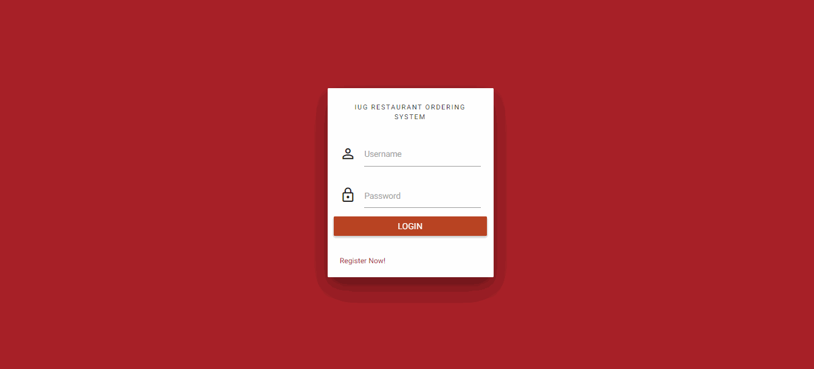
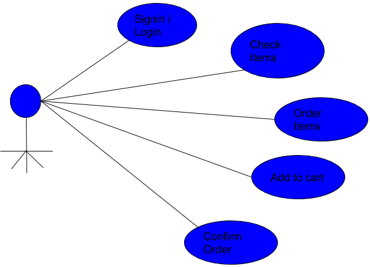
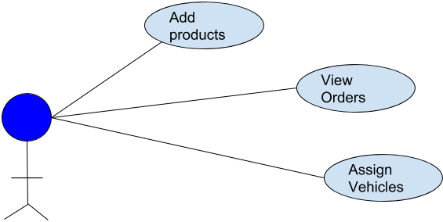
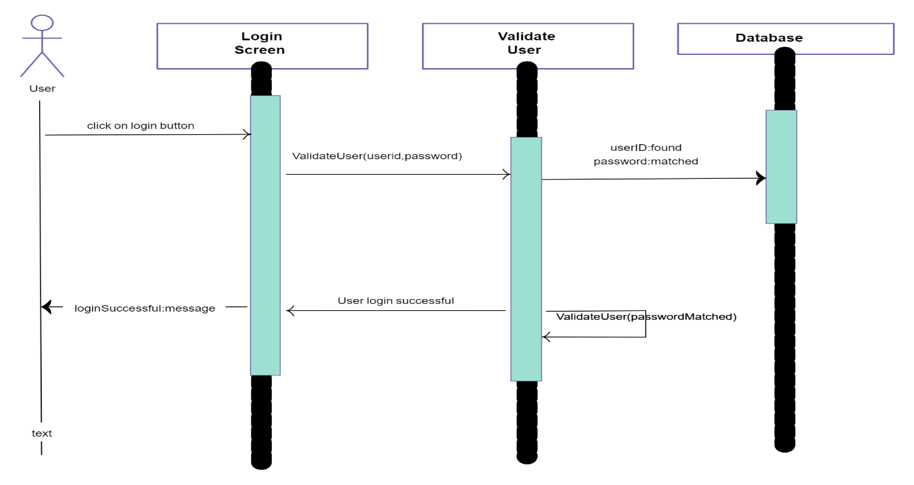
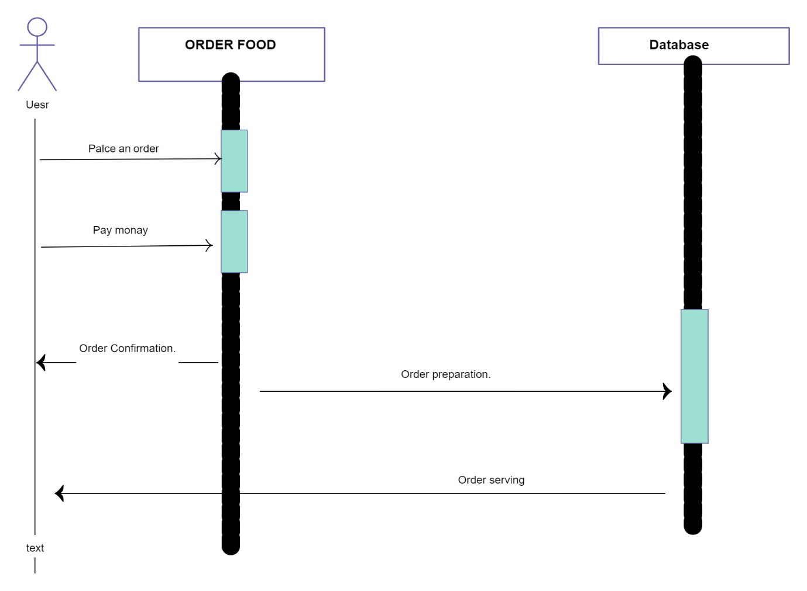
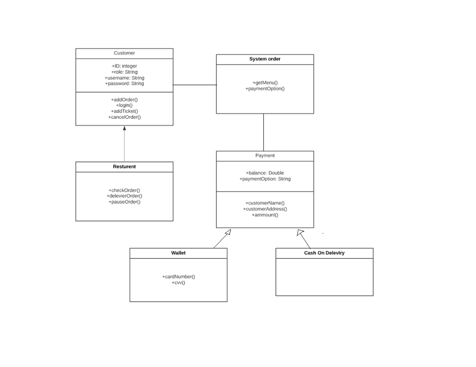

# IUG Restaurant ordering system
 ** ** There is a lot of scope online food ordering business and we can tap it to the max extent possible as everyone has access to an online ordering facility via the internet. Food business usually will have high demand and hence online business prospect for food ordering should be profitable. We will provide an easily accessible interface wherein the customer can view and place the order easily. 
 
 ** ** The customer can register initially with minimum details and will be allowed to check the menu items before ordering them, adding them to cart and submit the order. The system records the details in MySQL database so that it will be easy to retrieve later. The users of the system also include employee who will handle info related to product addition and delivery or rejection of the request.
 
 
 ** **  هناك الكثير من مجالات طلب الطعام عبر الإنترنت ويمكننا الاستفادة منه إلى أقصى حد ممكن حيث يمكن للجميع الوصول إلى منشأة الطلب عبر الإنترنت عبر الإنترنت. عادة ما يكون هناك طلب مرتفع على تجارة المواد الغذائية ، وبالتالي يجب أن تكون آفاق الأعمال التجارية عبر الإنترنت لطلب الطعام مربحة. سنوفر واجهة يمكن الوصول إليها بسهولة حيث يمكن للعميل عرض الطلب ووضعه بسهولة. 

 ** **  يمكن للعميل التسجيل مبدئيًا مع الحد الأدنى من التفاصيل وسيُسمح له بفحص عناصر القائمة قبل طلبها وإضافتها إلى سلة التسوق وإرسال الطلب. يسجل النظام التفاصيل في قاعدة بيانات MySQL بحيث يكون من السهل استرجاعها لاحقًا. يشمل مستخدمو النظام أيضًا الموظف الذي سيتعامل مع المعلومات المتعلقة بإضافة المنتج وتسليم الطلب أو رفضه.

### User interfaces GIF

## This project was programmed by:
1. Baraa  Salout        120160721 
2. Mohanned Abu Hassira	120161005
3. Baraa Al-Astal 	    	120161134 
4. Moomen Al-Dahdouh 	 	120161501

## diagram 

### Use case diagram for Customers

### Use case diagram for Employees

### sequence diagram for login

### sequence diagram for request an order.

### Class diagram for order operation.

## Run project in your device:
1. install xampp by [Download xampp link](https://www.apachefriends.org/download.html) and start of **apache and mySQL** from contol panal of xampp.
2. select **explorer** from contol panal of xampp and all folder project *as name "food"* in **htdocs folder** in this folder open after select explorer.
3. add food.sql from **SQL folder** in localhost/phpmyadmin database.  
4. run project in your browser by localhost/food 
